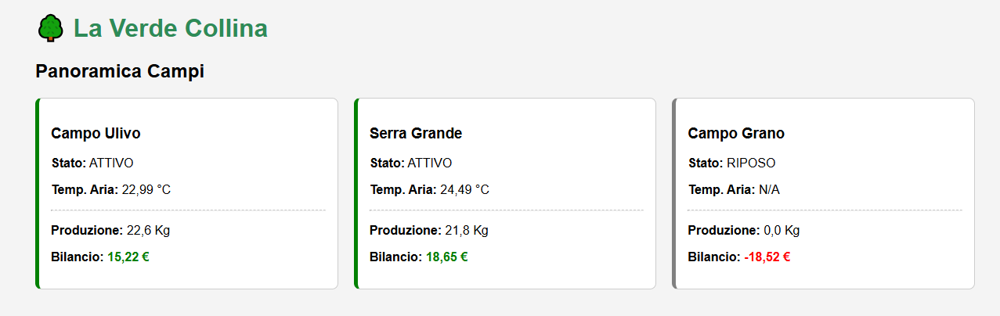

# 🌳 La Verde Collina - IoT Digital Twin & Monitoring Dashboard

> **Progetto Accademico - Corso di Laurea in Informatica per le Aziende Digitali**
> *Sviluppo di una dashboard in Java per l'analisi delle prestazioni aziendali nel settore primario.*


## 📄 Descrizione del Progetto

**La Verde Collina** è una piattaforma software progettata per supportare la digitalizzazione delle aziende agricole moderne (Agricoltura 4.0).
Il sistema implementa un **Gemello Digitale (Digital Twin)** che simula l'ecosistema produttivo ed economico di un'azienda agricola, permettendo il monitoraggio in tempo reale di parametri ambientali e finanziari.

L'obiettivo è fornire uno strumento di **Supporto alle Decisioni (DSS)** che correli i dati di telemetria (sensori IoT) con i risultati economici (costi/ricavi), offrendo una visione olistica della gestione aziendale.

## 🚀 Funzionalità Chiave

* **🌱 Simulazione IoT Stocastica:** Un motore interno (`SimulatoreServizio`) genera dati ambientali (temperatura, umidità, NDVI) realistici basati su distribuzione Gaussiana, simulando fluttuazioni microclimatiche naturali.
* **💰 Modello Economico Dinamico:** Calcolo in tempo reale del bilancio economico per ogni campo. Il sistema distingue tra:
    * *Campi Attivi:* Generano produzione e costi variabili.
    * *Campi a Riposo:* Generano solo costi di manutenzione.
* **📊 Dashboard Interattiva:** Interfaccia web responsive realizzata con **Thymeleaf** e **Chart.js** per la visualizzazione di KPI e grafici di trend storici (ultime 24h).
* **💾 Persistenza Storica:** Storicizzazione di tutte le rilevazioni su database relazionale **MySQL** per analisi a lungo termine.

## 🛠️ Stack Tecnologico

Il progetto è sviluppato seguendo un'architettura a livelli (Controller-Service-Repository) basata su:

* **Backend:** Java 21 (LTS), Spring Boot 3 (Web, Data JPA).
* **Database:** MySQL Server.
* **Frontend:** HTML5, CSS3, Thymeleaf, JavaScript (Chart.js, jQuery).
* **Tools:** Maven (Build), Lombok (Boilerplate reduction), Git (Versioning).

## ⚙️ Installazione e Avvio

### Prerequisiti
* JDK 21 installato.
* MySQL Server in esecuzione.
* Maven.

### Configurazione
1.  Clona il repository:
    ```bash
    git clone [https://github.com/andreaginda/La-Verde-Collina.git](https://github.com/andreaginda/La-Verde-Collina.git)
    ```
2.  Configura il database:
    * Crea un database vuoto su MySQL (es. `collina_db`).
    * Rinomina il file `src/main/resources/application.properties.esempio` in `application.properties`.
    * Inserisce le tue credenziali MySQL nel file.

3.  Avvia l'applicazione:
    ```bash
    mvn spring-boot:run
    ```
4.  Accedi alla dashboard tramite browser all'indirizzo: `http://localhost:8080`

## 📷 Anteprima (Screenshot)

**

---
**Autore:** Andrea Ginda
**Matricola:** 0312200178
**Università Telematica Pegaso**